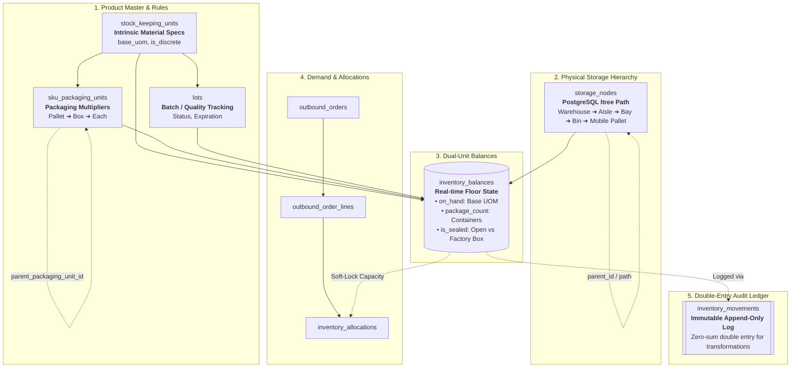

# Warehouse Core Engine (WMS) — Quick Reference & Architecture

This database schema is an enterprise-grade WMS engine designed to solve the classic tension between **pure inventory accounting** (financial base units) and **physical floor reality** (pallets, cartons, and loose eaches).

---

## System Architecture



---

## Core Mental Models & Rules of Thumb

### 1. The Dual-Unit Balance Rule

* **The Math Engine:** `on_hand` and `allocated` in `inventory_balances` are **always stored in the SKU's atomic `base_uom**` (`EACH`, `Kg`, `L`).
* **The Floor UI:** `pku_id` and `package_count` tell human pickers what the container looks like.
* **The Payoff:** System-wide Available-to-Promise (ATP) is a simple `SUM(on_hand - allocated)`—no nested joins or recursive conversions needed.

### 2. Physical Containment vs. Disposable Packaging

* **Use `storage_nodes` (LPNs)** when a container is **reusable, trackable, or movable as a whole unit** (e.g., a wood pallet `PLT-900`, a tote `TOT-12`, or a bulk liquid IBC tote).
* **Use `sku_packaging_units` (PKUs)** for **disposable vendor packaging** (e.g., cardboard boxes sharing the same factory UPC). You never spawn 5,000 database rows for 5,000 cardboard boxes; you store `package_count = 5000` on a single balance row.

### 3. State Transformations & Break-Bulk (`BREAK_PACKAGE`)

Because `source_node_id != destination_node_id` is strictly enforced, you never perform in-place mutations of packaging types. You log a **double-entry ledger transaction** tied by `reference_id`:

```
[Sealed Box Balance]  ---(Leg 1: Consume Box / Bin -> NULL)--->  [Void]
[Void]                ---(Leg 2: Produce Eaches / NULL -> Bin)---> [Loose Eaches Balance]

```

* The net change to base inventory across the warehouse is **$0$**.
* The movement history retains complete traceability of who cut the tape, when, and why.

### 4. Continuous Materials & Partial Boxes

* A cracked box of 500 screws with 42 remaining has:
* `package_count = 1`
* `is_sealed = false`
* `on_hand = 42.0000`


* A tapped 25 kg bag of flour with 18.5 kg remaining has:
* `package_count = 1`
* `is_sealed = false`
* `on_hand = 18.5000`


* **Pick Priority:** Allocation rules should search `is_sealed = false` first for small orders (to exhaust already-opened stock) and `is_sealed = true` for bulk carton orders.

---

## Operational Workflow Reference

| Operational Event | Balance Action | Movement Record |
| --- | --- | --- |
| **PO Receiving** | Upsert row with `is_sealed = true` | `source: NULL`, `dest: DOCK-01`, `reason: RECEIVING` |
| **Pallet Move** | No balance change | Update `storage_nodes.parent_id` (Trigger handles `ltree` recalculation) |
| **Stock Pick** | Decrement `on_hand`, increment `fulfilled_quantity` | `source: BIN-A`, `dest: PACK-STATION`, `reason: PICK` |
| **Decanting (Break Bulk)** | Deduct 1 sealed PKU; Add $N$ loose units | Two rows: (1) `source: BIN-A, dest: NULL`, (2) `source: NULL, dest: BIN-A`, `reason: BREAK_PACKAGE` |
| **Cycle Count Adjustment** | Update balance to scale/scanned actual | Single adjustment row with `reason: CYCLE_COUNT` |
